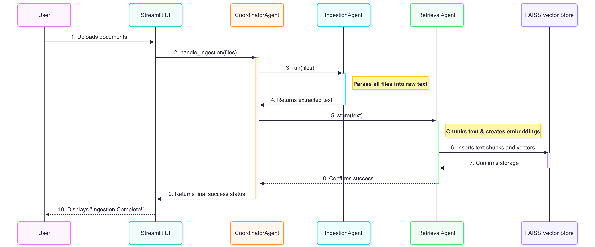

# Agentic RAG Chatbot for Multi-Format Document QA

This project is a sophisticated, agent-based Retrieval-Augmented Generation (RAG) chatbot built to answer user questions from a diverse set of uploaded documents. The architecture is designed around a multi-agent system where communication is handled via a structured Model Context Protocol (MCP).

## ✨ Features

- **Multi-Format Document Support**: Natively parses a wide range of document types for a comprehensive knowledge base.
    - PDF  
    - PPTX  
    - DOCX  
    - CSV  
    - TXT / Markdown
- **Agentic Architecture**: A robust multi-agent system orchestrates the entire RAG pipeline.
    - **`IngestionAgent`**: Parses and preprocesses uploaded documents.
    - **`RetrievalAgent`**: Chunks text, creates embeddings, and performs semantic search using a FAISS vector store.
    - **`LLMResponseAgent`**: Forms a detailed prompt with retrieved context and generates a final answer using an LLM.
    - **`CoordinatorAgent`**: Acts as a central orchestrator, managing the flow of requests and data between the other agents.
- **Model Context Protocol (MCP)**: All inter-agent communication uses a structured MCP-like JSON format, ensuring clarity and traceability.
- **View Source Context**: Each answer is accompanied by the exact source chunks retrieved from the documents, providing transparency and verifiability.
- **Interactive UI**: A user-friendly interface built with Streamlit allows for easy document uploads and multi-turn conversations.

## 🏗️ Architecture and System Flow

The application operates on a coordinated, multi-agent architecture. The `CoordinatorAgent` acts as the central hub, directing traffic between the specialized agents.

  

1. **Upload**: The user uploads documents via the Streamlit UI.
2. **Ingestion**: The `CoordinatorAgent` triggers the `IngestionAgent`, which parses all files into raw text.
3. **Embedding & Storage**: The extracted text is passed to the `RetrievalAgent`, which chunks the text, generates embeddings using a Hugging Face model, and stores them in an in-memory FAISS vector store.
4. **Query**: The user asks a question in the chat interface.
5. **Retrieval**: The `CoordinatorAgent` sends the query to the `RetrievalAgent`, which performs a similarity search on the vector store to find the most relevant context chunks.
6. **Generation**: These chunks are sent to the `LLMResponseAgent`, which constructs a detailed prompt and calls the Groq LLM to generate a final, context-aware answer.
7. **Response**: The final answer, along with its source chunks, is displayed to the user in the UI.

## 🛠️ Tech Stack

- **Backend**: Python
- **UI**: Streamlit
- **RAG & Orchestration**: LangChain
- **Embeddings**: Sentence Transformers (Hugging Face)
- **Vector Store**: FAISS (In-Memory)
- **LLM**: Groq (Llama 3)

## 🚀 Setup and Installation

Follow these steps to set up and run the project locally.

### Prerequisites

- Python 3.9+
- Git

### 1. Clone the Repository

```bash
git clone https://github.com/your-username/your-repo-name.git
cd your-repo-name
```

### 2. Set Up a Virtual Environment (Recommended)

```bash
python -m venv venv
source venv/bin/activate  # On Windows, use `venv\Scripts\activate`
```

### 3. Install Dependencies

```bash
pip install -r requirements.txt
```

### 4. Configure API Keys

The application requires a Groq API key to function.

1. Create a folder named `.streamlit` in the root of the project directory.
2. Inside `.streamlit`, create a file named `secrets.toml`.
3. Add your API key to the file as follows:

```toml
# .streamlit/secrets.toml
GROQ_API_KEY = "gsk_YourGroqApiKeyHere"
```

### 5. Run the Application

```bash
streamlit run app.py
```

Open your browser and navigate to the local URL provided by Streamlit (usually `http://localhost:8501`).

## ⚠️ Challenges Faced

- **Dependency Management**: The `langchain` library has recently been split into multiple sub-packages (`langchain-core`, `langchain-community`). This required careful dependency management to resolve `ModuleNotFoundError` issues during development.
- **Prompt Engineering**: Crafting the perfect prompt for the `LLMResponseAgent` was an iterative process. It was crucial to create a template that strongly instructs the LLM to answer *only* based on the provided context to prevent hallucinations.

## 🚧 Future Improvements

- **Asynchronous Ingestion**: For very large documents, the ingestion process could be made asynchronous to avoid blocking the UI, providing a smoother user experience.
- **Persistent Vector Store**: The current FAISS vector store is in-memory and resets on each run. This could be replaced with a persistent vector database like Chroma or a managed service to retain the knowledge base between sessions.
- **Formal Unit Testing**: Implementing `pytest` to create unit tests for each agent would improve the robustness and maintainability of the codebase.
